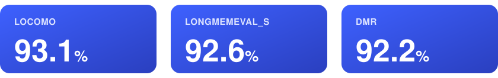
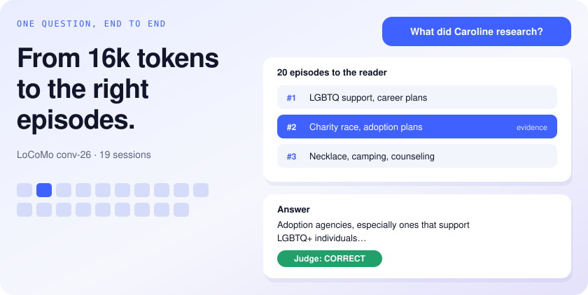
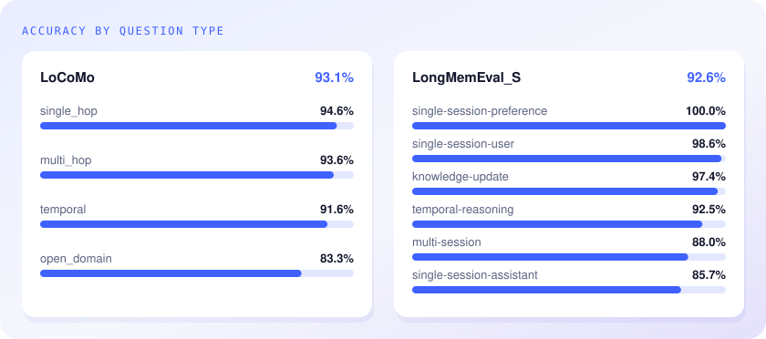
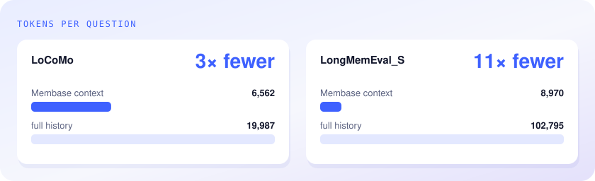
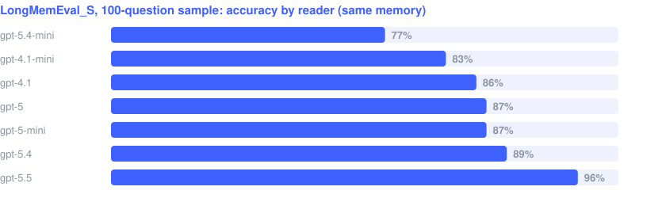
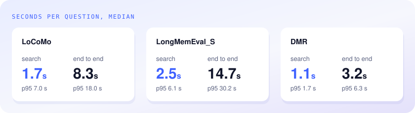

<p align="center">
  
</p>

<h1 align="center">membase-bench</h1>

<p align="center">
  <b>Long-term memory benchmarks for <a href="https://www.unibase.com/memory">Membase</a></b><br>
  LoCoMo · LongMemEval · DMR — reproducible end to end, with competitor baselines on the same data.
</p>

<p align="center">
  <a href="https://pypi.org/project/membase-core/"></a>
  
  <a href="LICENSE"></a>
</p>

<p align="center">
  
</p>

Membase answers long-term memory questions at 92–93% accuracy on three public benchmarks, handing
the model 3× (LoCoMo) to 11× (LongMemEval_S) fewer tokens than the full history.

## How Membase remembers

<p align="center">
  
</p>

Membase turns a conversation history into dated episodes. For each question it searches them and
hands the model only the ones that matter, with the evidence among them.

## Benchmarks

| | Questions | History per question | Reader | Judge (`gpt-4o-mini`) |
|---|---|---|---|---|
| [**LoCoMo**](https://github.com/snap-research/locomo) | 1,540 over 10 conversations (categories 1–4) | ~27 sessions, ~20k tokens | `gpt-4.1-mini` | Memori's CORRECT/WRONG prompt |
| [**LongMemEval_S**](https://huggingface.co/datasets/xiaowu0162/longmemeval) | 500 | ~50 sessions, ~103k tokens | `gpt-5.5` | Memori's prompt + LongMemEval's per-type rules |
| [**DMR**](https://huggingface.co/datasets/MemGPT/MSC-Self-Instruct) | 500 | 5 sessions, ~1.6k tokens | `gpt-4o-mini` | MemGPT's prompt (Zep's harness) |

Each benchmark follows the protocol of its best-known published numbers.

## Results

### Accuracy by question type



LoCoMo **93.12%** · LongMemEval_S **92.60%** · DMR **92.20%**.

### Context per question



The context stays at a few thousand tokens however long the history grows.

### Retrieval and the reader



98.1% of LoCoMo's and 99.95% of LongMemEval_S's evidence sessions reach the model, so most wrong
answers come from the reader; a stronger reader lifts LongMemEval_S, hence `gpt-5.5`.

### Latency



## Run it

```bash
git clone https://github.com/unibaseio/membase-bench && cd membase-bench
uv venv --python 3.12 && uv pip install --torch-backend cpu -e ".[dev]" && source .venv/bin/activate
export OPENAI_API_KEY=sk-... MEMBASE_EPISODE_MODEL=gpt-4.1-mini MEMBASE_DECIDER_MODEL=gpt-4.1-mini MEMBASE_READER_MODEL=gpt-4.1-mini

curl -L -o data/longmemeval_s.json https://huggingface.co/datasets/xiaowu0162/longmemeval/resolve/main/longmemeval_s
curl -L --create-dirs -o data/dmr/msc_self_instruct.jsonl https://huggingface.co/datasets/MemGPT/MSC-Self-Instruct/resolve/main/msc_self_instruct.jsonl

# LoCoMo
python -m bench.locomo.ours_core --out runs/locomo.jsonl --workdir .cache/locomo --workers 4 --question-workers 8 --resume
python -m bench.locomo.memori_official_eval runs/locomo.jsonl --out runs/locomo.judged.jsonl

# LongMemEval_S
MEMBASE_READER_MODEL=gpt-5.5 python -m bench.longmemeval.runner --out runs/lme.jsonl --workdir .cache/lme --workers 8 --ingest-workers 16 --resume
python -m bench.longmemeval.judge runs/lme.jsonl --out runs/lme.judged.jsonl

# DMR
python -m bench.dmr.runner --out runs/dmr.jsonl --workdir .cache/dmr --workers 12 --resume
python -m bench.dmr.judge runs/dmr.jsonl --out runs/dmr.judged.jsonl
```

Competitor systems (mem0, Memori, LangMem, Zep, Graphiti, full context) run on the same questions
and judges: see [baselines/](baselines/README.md).

## License

Copyright © 2026 Unibase. All rights reserved; see [LICENSE](LICENSE). The harness drives the proprietary membase-core engine through its public API only. Datasets
are downloaded from their sources under their own licenses (LoCoMo is CC BY-NC 4.0); prompts used
verbatim are listed in [NOTICE](NOTICE).
