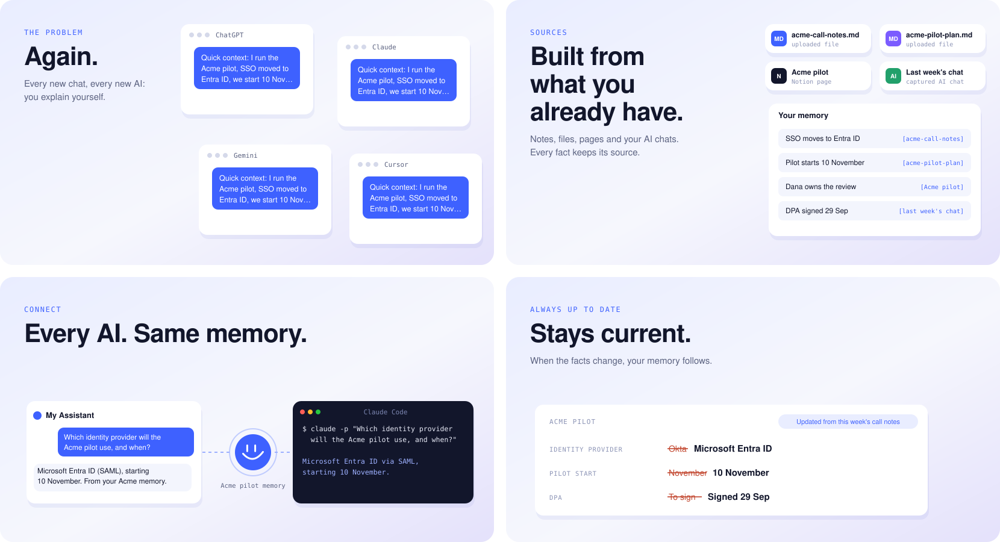
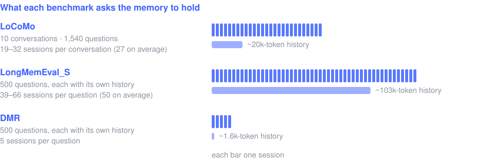
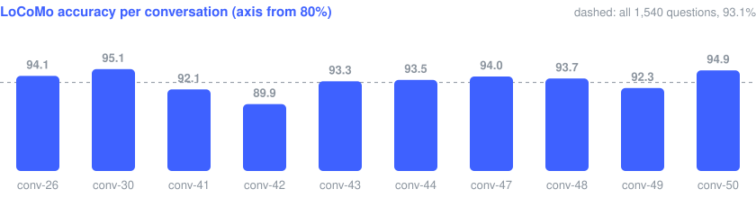
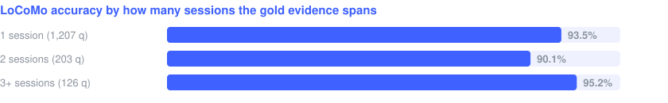
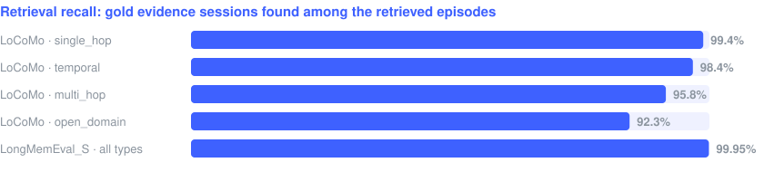
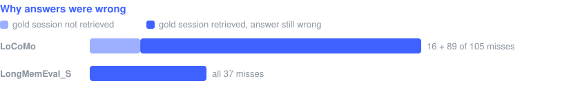
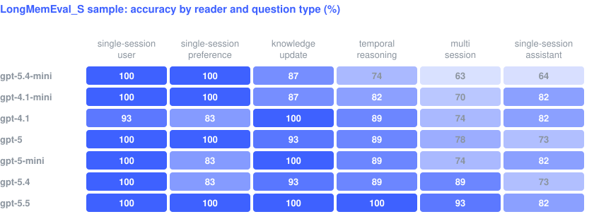
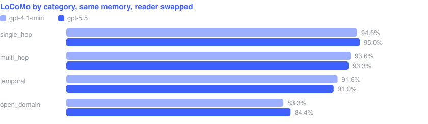
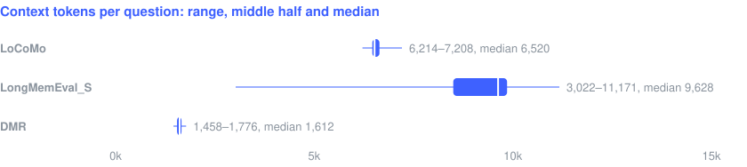
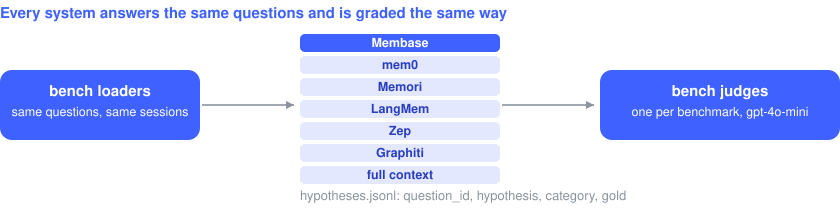

<p align="center">
  
</p>

<h1 align="center">membase-bench</h1>

<p align="center">
  <b>Long-term memory benchmarks for <a href="https://www.unibase.com/memory">Membase</a></b><br>
  LoCoMo · LongMemEval · DMR — reproducible end to end, with competitor baselines on the same data.
</p>

<p align="center">
  <a href="https://pypi.org/project/membase-core/"></a>
  
  <a href="LICENSE"></a>
</p>

<p align="center">
  
</p>

Membase hands the reader a few thousand tokens per question instead of the whole history, and it
finds the evidence: on LongMemEval_S the gold sessions were in the context for every miss.

<p align="center">
  
</p>

About 3× fewer tokens than the full conversation on LoCoMo, and 11× fewer on LongMemEval_S.

## What Membase does

<p align="center">
  
</p>

## One question, end to end

<p align="center">
  
</p>

Membase turns a long history into dated episodes, and for each question hands the reader only the
ones that matter; this repository measures how well that works. More at
[unibase.com/memory](https://www.unibase.com/memory); the SDK is
[membase-ai](https://github.com/unibaseio/membase-ai) (the illustrations above are drawn by its
`scripts/figures.py`).

## Quickstart

```bash
git clone https://github.com/unibaseio/membase-bench && cd membase-bench
uv venv --python 3.12 && uv pip install --torch-backend cpu -e ".[dev]" && source .venv/bin/activate
export OPENAI_API_KEY=sk-... MEMBASE_EPISODE_MODEL=gpt-4.1-mini MEMBASE_DECIDER_MODEL=gpt-4.1-mini MEMBASE_READER_MODEL=gpt-4.1-mini

python -m bench.locomo.ours_core --limit 1 --out runs/smoke.jsonl --workdir .cache/smoke
python -m bench.locomo.memori_official_eval runs/smoke.jsonl --out runs/smoke.judged.jsonl
```

One LoCoMo question, end to end, in a few minutes. Needs Python 3.12 or 3.13 on Linux, macOS or
Windows, and an OpenAI key.

## The benchmarks

Each benchmark keeps the protocol of its best-known published numbers.

| | What it tests | Reader | Judge (`gpt-4o-mini`) |
|---|---|---|---|
| **LoCoMo** | 10 long two-person conversations, 1,540 questions (categories 1–4) | `gpt-4.1-mini` | Memori's CORRECT/WRONG prompt |
| **LongMemEval_S** | 500 questions, each over its own ~50-session chat history | `gpt-5.5` | Memori's prompt + LongMemEval's per-type rules |
| **DMR** | 500 questions on MemGPT's MSC-Self-Instruct, Zep's harness verbatim | `gpt-4o-mini` | MemGPT's prompt |

<p align="center">
  
</p>

Each question runs the same path through [membase-core](https://pypi.org/project/membase-core/)'s
public API; episode extraction and the decider use `gpt-4.1-mini`.

<p align="center">
  
</p>


## Reproduce

```bash
python -m bench.locomo.ours_core --out runs/locomo.jsonl --workdir .cache/locomo --workers 4 --question-workers 8 --resume
python -m bench.locomo.memori_official_eval runs/locomo.jsonl --out runs/locomo.judged.jsonl

MEMBASE_READER_MODEL=gpt-5.5 python -m bench.longmemeval.runner --out runs/lme.jsonl --workdir .cache/lme --workers 8 --ingest-workers 16 --resume
python -m bench.longmemeval.judge runs/lme.jsonl --out runs/lme.judged.jsonl

python -m bench.dmr.runner --out runs/dmr.jsonl --workdir .cache/dmr --workers 12 --resume
python -m bench.dmr.judge runs/dmr.jsonl --out runs/dmr.judged.jsonl
```

LoCoMo takes about 35 minutes and DMR about 30. LongMemEval_S builds one store per question, about
one question a minute at `--workers 8`; `--stride 5` runs a 100-question sample. `--workdir` keeps
the stores, so a rerun skips ingestion.

<details>
<summary><b>Data</b></summary>

Datasets are not redistributed; they live in `data/` (`BENCH_DATA_DIR` overrides it). LoCoMo
downloads itself on first use. LongMemEval_S is the original release, not `longmemeval-cleaned`.

```bash
curl -L -o data/longmemeval_s.json https://huggingface.co/datasets/xiaowu0162/longmemeval/resolve/main/longmemeval_s
curl -L --create-dirs -o data/dmr/msc_self_instruct.jsonl https://huggingface.co/datasets/MemGPT/MSC-Self-Instruct/resolve/main/msc_self_instruct.jsonl
```

</details>

<details>
<summary><b>Install with pip, or with a GPU</b></summary>

```bash
python3.12 -m venv .venv && source .venv/bin/activate              # Windows: .venv\Scripts\activate
pip install torch --index-url https://download.pytorch.org/whl/cpu   # Linux without a GPU; skip on macOS / Windows
pip install -e ".[dev]"
```

The CPU build of torch (which the engine's cross-encoder needs) keeps the environment at about
1.5 GB; with uv, drop `--torch-backend cpu` for the CUDA build (about 6 GB on Linux). `pytest`
checks the install offline.

</details>

<details>
<summary><b>Accuracy in detail</b></summary>

LoCoMo **93.12%** (1,540 questions) · LongMemEval_S **92.60%** (500, 95% CI 90.0–94.6) · DMR
**92.20%** (500, 95% CI 89.5–94.2).






The score holds across all ten LoCoMo conversations (89.9–95.1%), and questions whose evidence
spans three or more sessions do as well as single-session ones.

</details>

<details>
<summary><b>Retrieval or reader?</b></summary>





Retrieval puts the gold session in front of the reader for 98.1% of LoCoMo and 99.95% of
LongMemEval_S evidence, so most wrong answers are the reader's. On DMR each memory is only 5–7
episodes and all of it reaches the reader; with the same `gpt-4o-mini` reader the
[Zep paper](https://arxiv.org/abs/2501.13956) (Table 1) reports 98.2% for Zep and 98.0% for the
full conversation in context.




On LongMemEval_S the reader matters, most on multi-session and temporal questions, hence `gpt-5.5`.



On LoCoMo it does not: `gpt-5.5` scores 93.18% on the same stores, at most 1.1 points from
`gpt-4.1-mini` in any category.

</details>

<details>
<summary><b>Latency and context size</b></summary>




Search includes the multi-round decider's LLM calls. The context stays bounded however long the
history is. `python -m bench.efficiency {locomo,longmemeval,dmr} --workdir <kept stores>` measures
both on your own run.

</details>

<details>
<summary><b>Analysis tools</b></summary>

```bash
python -m bench.locomo.compare runs/a.judged.jsonl runs/b.judged.jsonl   # paired per-question flips
python -m bench.retrieval_metrics runs/locomo.judged.jsonl                # evidence recall; retrieval vs reader misses
python -m bench.longmemeval.judge runs/lme.jsonl --out x.jsonl --membase-judge --judge-runs 3   # majority of three judges
```

</details>

<details>
<summary><b>Memory size and ingest cost</b></summary>

| | LoCoMo | LongMemEval_S | DMR |
|---|---|---|---|
| episodes in the store | 32 per conversation | 54 per question | 5 per question |
| store size | ~11.5k tokens per conversation | ~28.7k tokens per question | ~1.7k tokens per question |
| ingest LLM input | 176k tokens per conversation (1.8M in all) | 449k tokens per question (225M in all) | 25k tokens per question (12.7M in all) |

Ingest is the expensive step and runs once: `--workdir` keeps the stores, and every later
re-answer or judge pass reuses them.

</details>

<details>
<summary><b>Output files</b></summary>

Runners write one JSON object per question:

| Field | |
|---|---|
| `question_id`, `category` | from the dataset (`conv-26-q3`, `multi_hop`) |
| `hypothesis` | the answer; `ERROR: …` when the question failed, `[NO_CONTEXT]` when LongMemEval retrieval was empty |
| `gold` | the dataset's answer |
| `retrieved_sessions`, `retrieved_observations` | the sessions of the episodes handed to the reader, and how many episodes |

Judges copy each row and add `correct` and, by benchmark, `label` (`CORRECT` / `WRONG`; LoCoMo and
LongMemEval), `question`, `judge_response` and `f1` (LoCoMo token F1), or `excluded` (an unreadable
verdict, left out of the denominator; LongMemEval and DMR).

</details>

<details>
<summary><b>Add your own memory system</b></summary>

A system is a runner that writes the same rows; the judges do the rest.

1. Load the questions with `baselines.common.dataset.load()` (`BENCH_DATASET=locomo` or
   `longmemeval`). Each instance has `sessions` (each with `session_date` and `turns` of `role`,
   `speaker`, `content`) and a `question` (`question`, `question_date`, `answer`, `category`).
2. Ingest the sessions into your system, then answer each question.
3. Write `{question_id, hypothesis, category, gold}` per question, as above.
4. Grade with `python -m bench.locomo.memori_official_eval` (or `bench.longmemeval.judge`).

[`baselines/locomo/full_context_runner.py`](baselines/locomo/full_context_runner.py) is the
smallest working example.

</details>

<details>
<summary><b>FAQ</b></summary>

**Why a lenient judge on LoCoMo?** Memori's CORRECT/WRONG prompt is the one behind the published
LoCoMo numbers this is compared with. A stricter judge lowers every system; grade all systems with
one judge before comparing them.

**Why drop LoCoMo category 5?** Its adversarial questions have no answer and need a refusal-aware
judge; published LoCoMo figures leave it out too. `--include-adversarial` keeps it.

**Why the original LongMemEval_S and not `longmemeval-cleaned`?** The published 92.6 was measured on
the original release; the cleaned release is different data, so scores on it are not comparable.

**Can I use other model providers?** The engine also runs on Anthropic, Ollama or any
OpenAI-compatible endpoint (`MEMBASE_LLM_PROVIDER`), but this harness's readers, judges and the
engine's embeddings call OpenAI; `OPENAI_BASE_URL` points them at an OpenAI-compatible endpoint.

**Why is search slower than a plain vector store?** The multi-round decider is 1–3 LLM calls per
question; it is what keeps the context small and the evidence in it.

**How do I compare two runs?** `bench.locomo.compare` pairs them question by question: it reports
which questions flipped either way, which a single accuracy difference hides, and each run's
accuracy with a Wilson interval.

</details>

<details>
<summary><b>Datasets and citation</b></summary>

| Dataset | Paper | License |
|---|---|---|
| [LoCoMo](https://github.com/snap-research/locomo) | [Evaluating Very Long-Term Conversational Memory of LLM Agents](https://arxiv.org/abs/2402.17753) | CC BY-NC 4.0 |
| [LongMemEval](https://huggingface.co/datasets/xiaowu0162/longmemeval) | [LongMemEval: Benchmarking Chat Assistants on Long-Term Interactive Memory](https://arxiv.org/abs/2410.10813) | MIT |
| [MSC-Self-Instruct](https://huggingface.co/datasets/MemGPT/MSC-Self-Instruct) (DMR) | [MemGPT: Towards LLMs as Operating Systems](https://arxiv.org/abs/2310.08560); protocol from [Zep](https://arxiv.org/abs/2501.13956) | Apache-2.0 |

The datasets are downloaded from their sources, not shipped here; LoCoMo's license is
non-commercial. To cite this harness:

```bibtex
@misc{membase-bench,
  title        = {membase-bench: Long-term memory benchmarks for Membase},
  author       = {{Unibase}},
  year         = {2026},
  howpublished = {\url{https://github.com/unibaseio/membase-bench}}
}
```

</details>

## Baselines

<p align="center">
  
</p>

mem0, Memori, LangMem, Zep, Graphiti and a full-context ceiling, on the same LoCoMo and
LongMemEval_S questions, graded by the same judges — see [baselines/](baselines/README.md).

## License

MIT. The harness drives the proprietary membase-core engine through its public API only; judges and
readers call OpenAI directly. Prompts used verbatim from Memori, Zep and MemGPT are listed in
[NOTICE](NOTICE). The figures are drawn by `scripts/figures.py` from the published runs.
